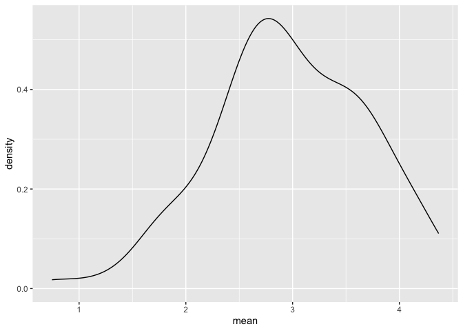
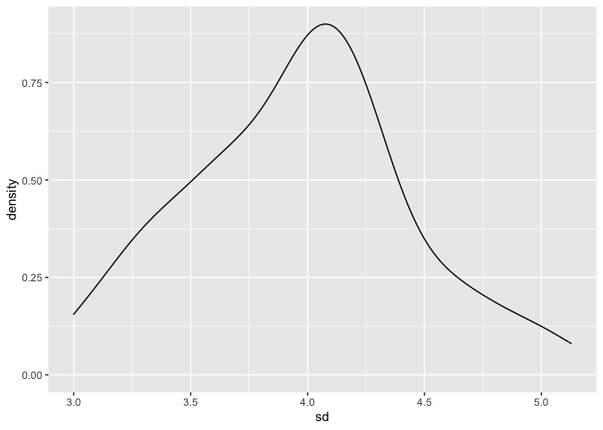

iteration
================
Nelson Gaillard
2025-11-13

``` r
library(tidyverse)
```

    ## ── Attaching core tidyverse packages ──────────────────────── tidyverse 2.0.0 ──
    ## ✔ dplyr     1.1.4     ✔ readr     2.1.5
    ## ✔ forcats   1.0.0     ✔ stringr   1.5.1
    ## ✔ ggplot2   3.5.2     ✔ tibble    3.3.0
    ## ✔ lubridate 1.9.4     ✔ tidyr     1.3.1
    ## ✔ purrr     1.1.0     
    ## ── Conflicts ────────────────────────────────────────── tidyverse_conflicts() ──
    ## ✖ dplyr::filter() masks stats::filter()
    ## ✖ dplyr::lag()    masks stats::lag()
    ## ℹ Use the conflicted package (<http://conflicted.r-lib.org/>) to force all conflicts to become errors

``` r
library(rvest)
```

    ## 
    ## Attaching package: 'rvest'
    ## 
    ## The following object is masked from 'package:readr':
    ## 
    ##     guess_encoding

``` r
library(p8105.datasets)

set.seed(1)
```

## Do something simple

``` r
x_vec = rnorm(30, mean = 5, sd = 3)

(x_vec - mean(x_vec)) / sd(x_vec)
```

    ##  [1] -0.767120446  0.109493425 -0.993470503  1.637039863  0.267334741
    ##  [6] -0.977065475  0.438222871  0.709719461  0.533829741 -0.419692475
    ## [11]  1.546684110  0.332624325 -0.761479160 -2.485776741  1.128069748
    ## [16] -0.137851865 -0.106748415  0.932105430  0.799422547  0.553437533
    ## [21]  0.905205442  0.757128408 -0.008541293 -2.241925304  0.581490604
    ## [26] -0.149966223 -0.257816586 -1.680744021 -0.606639531  0.363029790

I want a function to compute z-scores

``` r
z_scores = function(x) {
  
  if (!is.numeric(x)) {
    stop("Input must be numeric")
  }
  
  if (length(x) < 3) {
    stop("Input must have at least three numbers")
  }
  
  z = (x - mean(x)) / sd(x)
  
  return(z)
  
}

z_scores(x_vec)
```

    ##  [1] -0.767120446  0.109493425 -0.993470503  1.637039863  0.267334741
    ##  [6] -0.977065475  0.438222871  0.709719461  0.533829741 -0.419692475
    ## [11]  1.546684110  0.332624325 -0.761479160 -2.485776741  1.128069748
    ## [16] -0.137851865 -0.106748415  0.932105430  0.799422547  0.553437533
    ## [21]  0.905205442  0.757128408 -0.008541293 -2.241925304  0.581490604
    ## [26] -0.149966223 -0.257816586 -1.680744021 -0.606639531  0.363029790

Try my function on some other things. These should give errors.

``` r
z_scores(3)
```

    ## Error in z_scores(3): Input must have at least three numbers

``` r
z_scores("my name is jeff")
```

    ## Error in z_scores("my name is jeff"): Input must be numeric

``` r
z_scores(mtcars)
```

    ## Error in z_scores(mtcars): Input must be numeric

``` r
z_scores(c(TRUE, TRUE, FALSE, TRUE))
```

    ## Error in z_scores(c(TRUE, TRUE, FALSE, TRUE)): Input must be numeric

## Multiple outputs

``` r
mean_and_sd = function(x) {
  
  if (!is.numeric(x)) {
    stop("Input must be numeric")
  }
  
  if (length(x) < 3) {
    stop("Input must have at least three numbers")
  }
  
  mean_x = mean(x)
  sd_x = sd(x)
  
  tibble(
    mean = mean_x,
    sd = sd_x
  )
  
}
```

Check that the function works.

``` r
x_vec = rnorm(100, mean = 3, sd = 4)
mean_and_sd(x_vec)
```

    ## # A tibble: 1 × 2
    ##    mean    sd
    ##   <dbl> <dbl>
    ## 1  3.43  3.39

## Multiple inputs

I’d like to do this with a function.

``` r
sim_data = 
  tibble(
    x = rnorm(100, mean = 4, sd = 3)
  )

sim_data |> 
  summarize(
    mean = mean(x),
    sd = sd(x)
  )
```

    ## # A tibble: 1 × 2
    ##    mean    sd
    ##   <dbl> <dbl>
    ## 1  3.87  3.18

``` r
sim_mean_sd = function(samp_size, mu = 3, sigma = 4) {
  
  sim_data = 
    tibble(
      x = rnorm(n = samp_size, mean = mu, sd = sigma)
    )

  sim_data |> 
    summarize(
      mean = mean(x),
      sd = sd(x)
    )
}

sim_mean_sd(samp_size = 100, mu = 6, sigma = 3)
```

    ## # A tibble: 1 × 2
    ##    mean    sd
    ##   <dbl> <dbl>
    ## 1  6.23  2.96

``` r
sim_mean_sd(samp_size = 100)
```

    ## # A tibble: 1 × 2
    ##    mean    sd
    ##   <dbl> <dbl>
    ## 1  2.96  4.03

## Let’s review Napoleon Dynamite

## Mean scoping example

``` r
f = function(x) {
  z = x + y
  z
}

x = 1
y = 2

f(x = y)
```

    ## [1] 4

## Functions as arguments

``` r
my_summary = function(x, summ_func) {
  
  summ_func(x)
  
}

x_vec = rnorm(100, 3, 7)

mean(x_vec)
```

    ## [1] 2.344811

``` r
median(x_vec)
```

    ## [1] 2.812312

``` r
my_summary(x_vec, IQR)
```

    ## [1] 9.834918

## Lists

You can put anything in a list.

``` r
l = list(
  vec_numeric = 5:8,
  vec_logical = c(TRUE, TRUE, FALSE, TRUE, FALSE, FALSE),
  mat = matrix(1:8, nrow = 2, ncol = 4),
  summary = summary(rnorm(100))
)
```

``` r
l
```

    ## $vec_numeric
    ## [1] 5 6 7 8
    ## 
    ## $vec_logical
    ## [1]  TRUE  TRUE FALSE  TRUE FALSE FALSE
    ## 
    ## $mat
    ##      [,1] [,2] [,3] [,4]
    ## [1,]    1    3    5    7
    ## [2,]    2    4    6    8
    ## 
    ## $summary
    ##     Min.  1st Qu.   Median     Mean  3rd Qu.     Max. 
    ## -2.33171 -0.59229 -0.13576  0.03153  0.72795  2.67574

``` r
l$vec_numeric
```

    ## [1] 5 6 7 8

``` r
l[(1)]
```

    ## $vec_numeric
    ## [1] 5 6 7 8

## ‘for’ loop

``` r
list_norm = 
  list(
    a = rnorm(20, mean = 3, sd = 1),
    b = rnorm(30, mean = 0, sd = 5),
    c = rnorm(40, mean = 10, sd = .2),
    d = rnorm(20, mean = 3, sd = 1)
  )
```

``` r
list_norm
```

    ## $a
    ##  [1] 1.7721174 2.4887808 2.2688050 3.0197520 1.4271361 2.2966667 3.7159321
    ##  [8] 3.4652149 2.0260977 3.5592177 0.5673603 2.6595151 3.7130332 2.3409626
    ## [15] 2.9635974 1.4067137 3.8477928 1.1496112 2.6763494 2.7447519
    ## 
    ## $b
    ##  [1]   0.30460614  -4.11745815   9.14865242  -7.14958108   1.27068572
    ##  [6] -14.69886848   0.01207904   2.54832786  -5.42360001   3.52416488
    ## [11]   1.65488175   4.88163736  -4.21669940  -4.85289952  -8.85765674
    ## [16]  -1.61235171  -6.69400371   3.44078014   0.35640326  10.94876180
    ## [21]  -5.78853800   5.90844032  -2.63684181  -7.28314006   2.86483685
    ## [26]  -7.16688852  -5.27592509  -3.66555939   1.05453632  -4.99460364
    ## 
    ## $c
    ##  [1] 10.215570  9.760205 10.043327 10.028617  9.786850  9.914275  9.868764
    ##  [8] 10.191879 10.311211  9.791841 10.186114  9.984911  9.606561  9.848819
    ## [15] 10.092230 10.029021  9.511538 10.116064 10.131010  9.939098  9.858486
    ## [22] 10.394314  9.982000  9.997197  9.775309  9.731174  9.695369  9.915606
    ## [29] 10.272185 10.350759 10.313673 10.259351  9.952481  9.755170  9.934437
    ## [36]  9.517510  9.937241 10.331976 10.026191 10.219178
    ## 
    ## $d
    ##  [1] 3.489341 2.221090 4.743559 2.921613 2.024446 3.070660 1.481400 3.863779
    ##  [9] 3.501568 2.645219 2.511571 3.936294 1.937592 2.016179 3.424248 2.548687
    ## [17] 3.925085 2.801379 4.194851 3.495545

Pause and get my old function.

``` r
mean_and_sd = function(x) {
  
  if (!is.numeric(x)) {
    stop("Input must be numeric")
  }
  
  if (length(x) < 3) {
    stop("Input must have at least three numbers")
  }
  
  mean_x = mean(x)
  sd_x = sd(x)
  
  tibble(
    mean = mean_x,
    sd = sd_x
  )
  
}
```

I can apply that function to each list element.

``` r
mean_and_sd(list_norm[[1]])
```

    ## # A tibble: 1 × 2
    ##    mean    sd
    ##   <dbl> <dbl>
    ## 1  2.51 0.923

``` r
mean_and_sd(list_norm[[2]])
```

    ## # A tibble: 1 × 2
    ##    mean    sd
    ##   <dbl> <dbl>
    ## 1 -1.55  5.65

``` r
mean_and_sd(list_norm[[3]])
```

    ## # A tibble: 1 × 2
    ##    mean    sd
    ##   <dbl> <dbl>
    ## 1  9.99 0.230

Let’s use a for loop:

``` r
output = vector("list", length = 4)

output[[1]] = mean_and_sd(list_norm[[1]])

for (i in 1:4) {
  
  output[[i]] = mean_and_sd(list_norm[[i]])
  
}
```

## Let’s try map!

``` r
output = map(list_norm, mean_and_sd)
```

What if you want a different function..?

``` r
output = map(list_norm, median)
```

``` r
output = map_dbl(list_norm, median, .id = "input")
```

``` r
output = map_df(list_norm, mean_and_sd, .id = "input")
```

## List columns!

``` r
listcol_df = 
  tibble(
    name = c("a", "b", "c", "d"), 
    samp = list_norm
  )
```

``` r
listcol_df |> pull(name)
```

    ## [1] "a" "b" "c" "d"

``` r
listcol_df |> pull(samp)
```

    ## $a
    ##  [1] 1.7721174 2.4887808 2.2688050 3.0197520 1.4271361 2.2966667 3.7159321
    ##  [8] 3.4652149 2.0260977 3.5592177 0.5673603 2.6595151 3.7130332 2.3409626
    ## [15] 2.9635974 1.4067137 3.8477928 1.1496112 2.6763494 2.7447519
    ## 
    ## $b
    ##  [1]   0.30460614  -4.11745815   9.14865242  -7.14958108   1.27068572
    ##  [6] -14.69886848   0.01207904   2.54832786  -5.42360001   3.52416488
    ## [11]   1.65488175   4.88163736  -4.21669940  -4.85289952  -8.85765674
    ## [16]  -1.61235171  -6.69400371   3.44078014   0.35640326  10.94876180
    ## [21]  -5.78853800   5.90844032  -2.63684181  -7.28314006   2.86483685
    ## [26]  -7.16688852  -5.27592509  -3.66555939   1.05453632  -4.99460364
    ## 
    ## $c
    ##  [1] 10.215570  9.760205 10.043327 10.028617  9.786850  9.914275  9.868764
    ##  [8] 10.191879 10.311211  9.791841 10.186114  9.984911  9.606561  9.848819
    ## [15] 10.092230 10.029021  9.511538 10.116064 10.131010  9.939098  9.858486
    ## [22] 10.394314  9.982000  9.997197  9.775309  9.731174  9.695369  9.915606
    ## [29] 10.272185 10.350759 10.313673 10.259351  9.952481  9.755170  9.934437
    ## [36]  9.517510  9.937241 10.331976 10.026191 10.219178
    ## 
    ## $d
    ##  [1] 3.489341 2.221090 4.743559 2.921613 2.024446 3.070660 1.481400 3.863779
    ##  [9] 3.501568 2.645219 2.511571 3.936294 1.937592 2.016179 3.424248 2.548687
    ## [17] 3.925085 2.801379 4.194851 3.495545

``` r
listcol_df |> 
  filter(name == "a")
```

    ## # A tibble: 1 × 2
    ##   name  samp        
    ##   <chr> <named list>
    ## 1 a     <dbl [20]>

Let’s try some operations.

``` r
mean_and_sd(listcol_df$samp[[1]])
```

    ## # A tibble: 1 × 2
    ##    mean    sd
    ##   <dbl> <dbl>
    ## 1  2.51 0.923

``` r
mean_and_sd(listcol_df$samp[[2]])
```

    ## # A tibble: 1 × 2
    ##    mean    sd
    ##   <dbl> <dbl>
    ## 1 -1.55  5.65

Can I just…map?

``` r
map(listcol_df$samp, mean_and_sd)
```

    ## $a
    ## # A tibble: 1 × 2
    ##    mean    sd
    ##   <dbl> <dbl>
    ## 1  2.51 0.923
    ## 
    ## $b
    ## # A tibble: 1 × 2
    ##    mean    sd
    ##   <dbl> <dbl>
    ## 1 -1.55  5.65
    ## 
    ## $c
    ## # A tibble: 1 × 2
    ##    mean    sd
    ##   <dbl> <dbl>
    ## 1  9.99 0.230
    ## 
    ## $d
    ## # A tibble: 1 × 2
    ##    mean    sd
    ##   <dbl> <dbl>
    ## 1  3.04 0.871

So … can I add a list column??

``` r
listcol_df =
  listcol_df |> 
  mutate(
    summary = map(samp, mean_and_sd),
    medians = map_dbl(samp, median))
```

## Weather data

## Let’s simulate something

I have a function

``` r
sim_mean_sd = function(samp_size, mu = 3, sigma = 4) {
  
  sim_data = 
    tibble(
      x = rnorm(n = samp_size, mean = mu, sd = sigma)
    )

  sim_data |> 
    summarize(
      mean = mean(x),
      sd = sd(x)
    )
}
```

I can “simulalte” by running this line.

``` r
sim_mean_sd(30)
```

    ## # A tibble: 1 × 2
    ##    mean    sd
    ##   <dbl> <dbl>
    ## 1  2.85  4.98

## Let’s simulate a lot

Let’s start with a for loop

``` r
output = vector("list", length = 100)

for (i in 1:100) {
  
  output[[i]] = sim_mean_sd(samp_size = 30)
  
}

bind_rows(output)
```

    ## # A tibble: 100 × 2
    ##     mean    sd
    ##    <dbl> <dbl>
    ##  1  2.91  4.02
    ##  2  2.60  4.58
    ##  3  2.96  5.06
    ##  4  3.71  3.46
    ##  5  2.87  3.88
    ##  6  3.88  4.37
    ##  7  2.35  5.10
    ##  8  2.65  3.44
    ##  9  2.60  3.73
    ## 10  3.09  4.61
    ## # ℹ 90 more rows

Let’s use a loop function.

``` r
sim_results =
  rerun(100, sim_mean_sd(samp_size = 30)) |> 
  bind_rows()
```

    ## Warning: `rerun()` was deprecated in purrr 1.0.0.
    ## ℹ Please use `map()` instead.
    ##   # Previously
    ##   rerun(100, sim_mean_sd(samp_size = 30))
    ## 
    ##   # Now
    ##   map(1:100, ~ sim_mean_sd(samp_size = 30))
    ## This warning is displayed once every 8 hours.
    ## Call `lifecycle::last_lifecycle_warnings()` to see where this warning was
    ## generated.

Let’s look at results…

``` r
sim_results |> 
  ggplot(aes(x = mean)) + geom_density()
```

<!-- -->

``` r
sim_results |> 
  summarize(
    avg_samp_mean = mean(mean),
    sd_samp_mean = sd(mean)
  )
```

    ## # A tibble: 1 × 2
    ##   avg_samp_mean sd_samp_mean
    ##           <dbl>        <dbl>
    ## 1          2.97        0.720

``` r
sim_results |> 
  ggplot(aes(x = sd)) + geom_density()
```

<!-- -->
